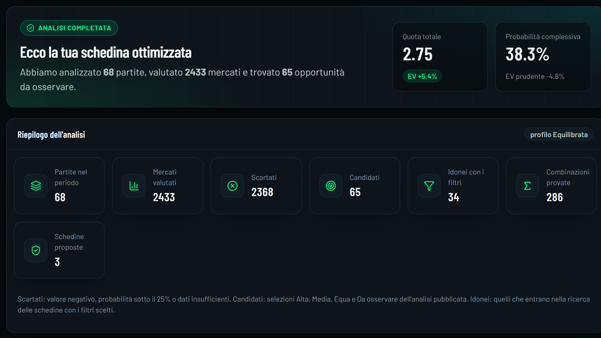
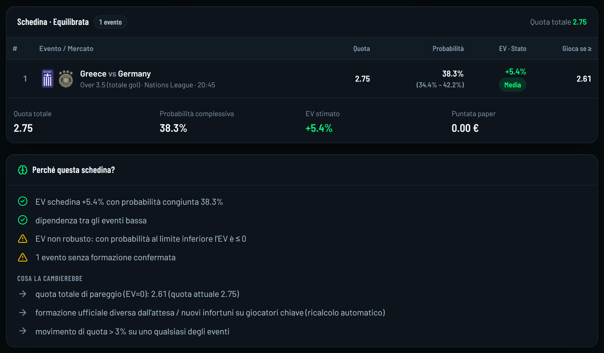
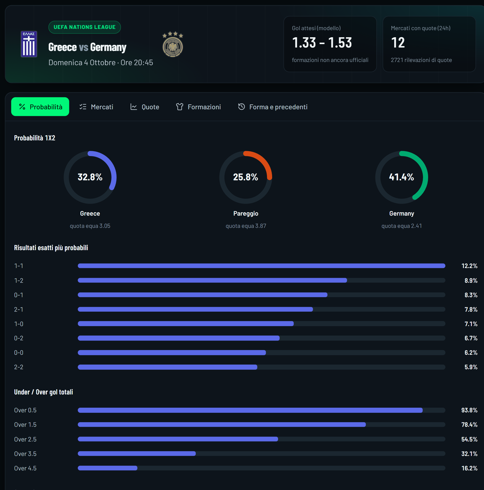
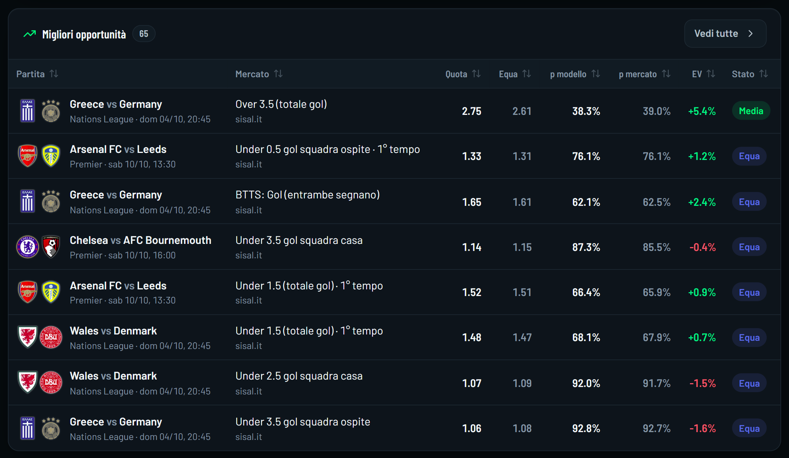
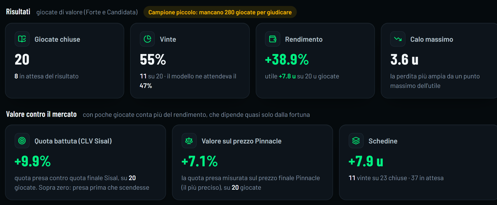
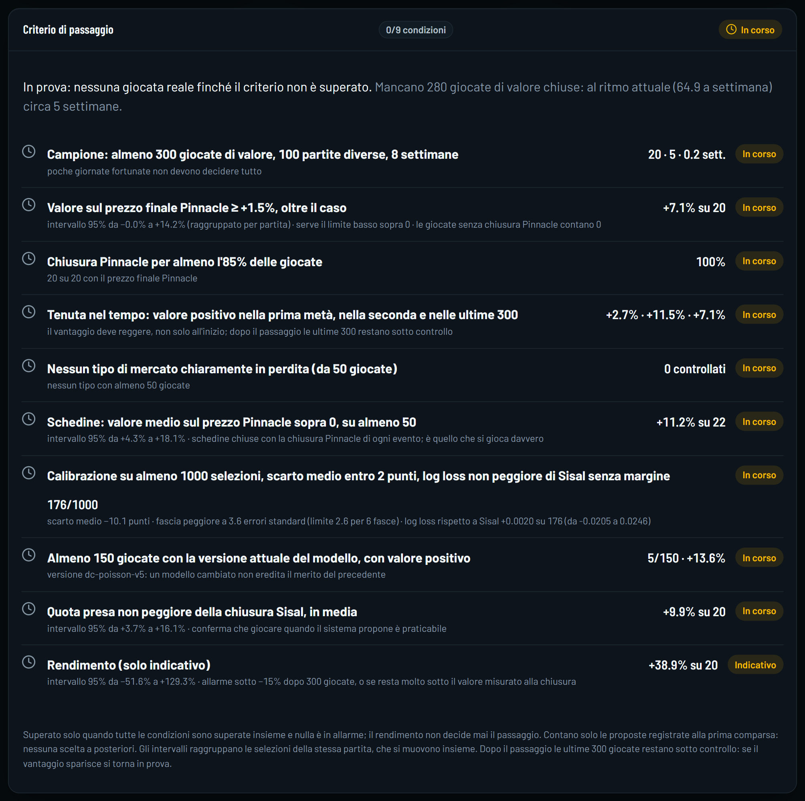
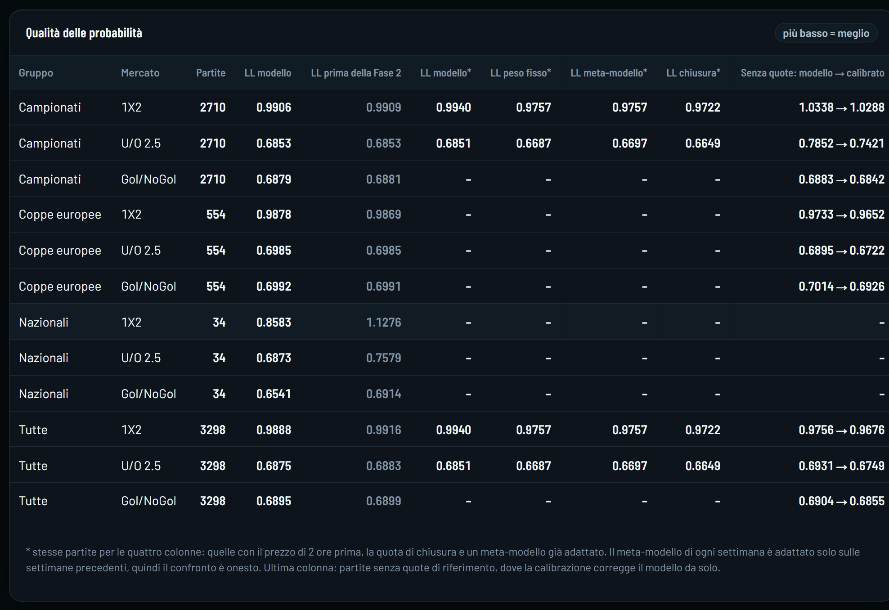
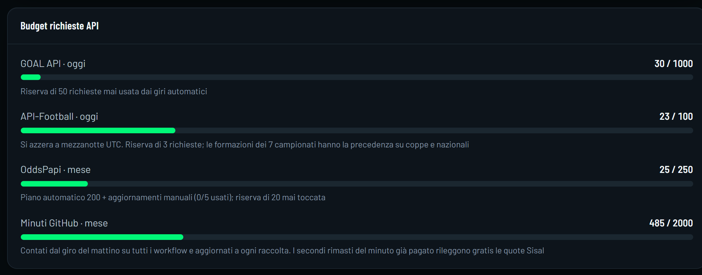
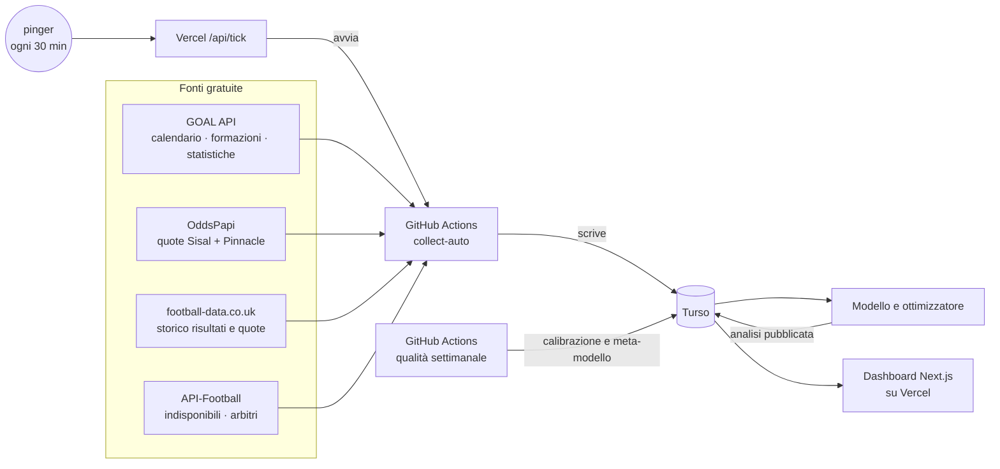

<div align="center">


# AlgoWinBet

**Analisi probabilistica del calcio, misurata contro il mercato più preciso.**
Probabilità proprie, quote Sisal, valore contro Pinnacle, schedine ottimizzate e un registro che non perdona.


</div>

> **Solo carta, uso personale.** AlgoWinBet non piazza scommesse. Ogni proposta finisce in un registro a 1 unità, e nulla si gioca davvero
> finché il [criterio di passaggio](#criterio-di-passaggio) non è superato.

---

## Cosa fa

- **Raccoglie da solo**, tutto online e gratis: calendario, formazioni, risultati, statistiche e quote Sisal + Pinnacle. Niente gira sul PC.
- **Stima le probabilità** di ogni mercato (1X2, doppia chance, U/O, Gol/NoGol, risultato esatto, tempi, corner, cartellini…) con un modello
  Dixon-Coles corretto da formazioni, livello della competizione e prezzo di mercato.
- **Misura il valore** di ogni quota Sisal contro la probabilità del modello e contro il prezzo senza margine di Pinnacle.
- **Costruisce schedine** ottimizzate per profilo (Massima probabilità, Equilibrata, Value) con il bonus multipla Sisal, oppure le valuta
  a mano.
- **Registra tutto alla prima comparsa** e lo chiude dopo la partita: CLV, valore alla chiusura, calibrazione reale. Nessuna scelta a posteriori.

## Uno sguardo

<p align="center">
  
</p>
<p align="center">
  
</p>
<p align="center">
  
</p>

<details>
<summary><b>Altre schermate</b>: opportunità, registro, criterio di passaggio, qualità del modello, budget</summary>
<br>

**Migliori opportunità**: quota Sisal, quota equa, probabilità del modello e del mercato, EV e stato.


**Registro**: risultati a carta e valore contro il mercato.


**Criterio di passaggio**: le nove condizioni e il loro stato.


**Qualità del modello**: log loss per gruppo e mercato contro il prezzo di chiusura.


**Budget**: richieste API e minuti GitHub del mese.


</details>

<sub>Schermate del 04/10/2026 dal sito reale (`node web/scripts/readme-shots.mjs` per rifarle).</sub>

## Come funziona



1. **Tick**: un pinger chiama `/api/tick` ogni 30 minuti; la route avvia un run di `collect` solo quando serve (partite vicine, risultati
   da chiudere, giro del mattino) e rispetta il budget dei minuti GitHub.
2. **Raccolta**: ogni run fa solo ciò che è dovuto (formazioni nella finestra prima del calcio d'inizio, fotografie Sisal, storico prezzi
   gratuito per le partite più vecchie di aggiornamento).
3. **Analisi**: modello → prezzo di mercato → meta-modello → calibrazione → EV prudente → stato (Forte, Candidata, Equa, Evita) →
   ottimizzatore delle schedine.
4. **Registro**: ogni proposta nuova entra a carta; dopo la partita si chiude da sola con CLV Sisal e valore alla chiusura Pinnacle.
5. **Qualità**: ogni lunedì un replay walk-forward misura log loss e calibrazione e riaddestra il meta-modello.

## La dashboard

| Pagina | Cosa mostra |
|---|---|
| **Home** | Schedine proposte per profilo, filtri (quota, probabilità, EV minimo, mercati), perché questa schedina, budget API e minuti GitHub |
| **Opportunità** | Tutte le selezioni con valore, ordinate per forza del segnale |
| **Palinsesto** | Le partite in arrivo con quote Sisal; crea una schedina manuale |
| **Schedina** | Valutazione di una schedina scelta a mano: probabilità congiunta, EV, bonus |
| **Partita** | Analisi profonda: probabilità per mercato, formazioni, andamento delle quote, indisponibili |
| **Registro** | Risultati a carta, valore contro il mercato, criterio di passaggio, calibrazione reale |
| **Qualità** | Replay settimanale: log loss contro mercato e chiusura, calibrazione, meta-modello |
| **Sistema** | Stato della raccolta, budget delle fonti, minuti GitHub del mese, ultimi run |

## Regole del gioco

- **Solo Sisal è giocabile.** Pinnacle è il riferimento per misurare il valore, mai una quota da prendere.
- **Quota minima 1,20 per evento**: sotto, più rumore che valore.
- **Mai nazionali e club nella stessa schedina**, anche se quota ed EV sono buoni.
- **Cartellini con la regola Sisal**: gialli 1, rossi 1, il secondo giallo prima del rosso non conta, solo tempi regolamentari.
- **Un cambio al modello entra solo con un guadagno chiaro** fuori campione (circa 0,005 di log loss); ogni versione ha risultati separati.

## Criterio di passaggio

Il rendimento con poche centinaia di giocate è quasi solo fortuna. Il criterio misura invece **il valore sul prezzo finale di Pinnacle**,
il prezzo più preciso del mercato. Tutte e nove le condizioni devono essere vere insieme:

| # | Condizione |
|---|---|
| 1 | almeno **300** giocate di valore chiuse, su **100** partite diverse, in **8** settimane |
| 2 | valore medio sul prezzo finale Pinnacle **≥ +1,5%**, con il limite basso dell'intervallo al 95% sopra 0 (le giocate senza chiusura contano 0) |
| 3 | prezzo finale Pinnacle disponibile per **≥ 85%** delle giocate |
| 4 | valore positivo nella **prima metà**, nella **seconda** e nelle **ultime 300** |
| 5 | nessun tipo di mercato (≥ 50 giocate) **chiaramente in perdita** |
| 6 | **schedine** con valore medio sul prezzo Pinnacle sopra 0, su almeno 50 |
| 7 | **calibrazione** su ≥ 1.000 selezioni: nessuna fascia fuori, scarto medio entro 2 punti, log loss non peggiore di Sisal senza margine |
| 8 | almeno **150** giocate con la **versione attuale** del modello, con valore positivo |
| 9 | quote prese **non peggiori della chiusura Sisal** in media |

Il rendimento resta solo un allarme (sotto −15%, o molto sotto il valore misurato). Gli intervalli raggruppano le selezioni della stessa
partita. Dopo il passaggio le ultime 300 giocate restano sotto controllo: se il vantaggio sparisce si torna in prova.

## Tutto gratis, con i limiti sotto controllo

| Risorsa | Limite | Come si rispetta |
|---|---|---|
| GOAL API | 1.000 richieste al giorno | contatore con riserva, formazioni solo nella finestra prima del calcio d'inizio |
| OddsPapi | 250 richieste al mese | fotografie solo Sisal pianificate; storico prezzi gratuito (richieste libere) |
| API-Football | 100 richieste al giorno | una lettura per competizione e giorno |
| GitHub Actions | 2.000 minuti al mese (repo privato) | il secondo già pagato legge prezzi gratis; risparmio sopra 1.700 previsti, solo giro del mattino sopra 1.900 |
| Turso, Vercel | piani gratuiti | replica locale nei run, cache per versione dei dati |

## Stato delle fasi

| Fase | | Stato |
|---|---|---|
| 0 | Pulizia | ✅ |
| 1 | Scaricamento automatico dei CSV storici | ✅ |
| 2 | Modello più preciso (livello competizione, forma, prior di mercato) | ✅ |
| 3 | Test sul passato (replay walk-forward settimanale) | ✅ |
| 4 | Calibrazione e pesi appresi (meta-modello) | ✅ attiva sulla v5 |
| 5 | Ottimizzatore e Home | 🟡 manca la taratura dell'EV prudente |
| 6 | Paper trading automatico e criterio di passaggio | 🟡 registro attivo, criterio severo in corso |
| 6-bis | Formazioni, indisponibili, importanza dei giocatori | 🟡 formazioni e indisponibili attivi |
| 7 | Corner e cartellini | 🟡 attivi corner e 1X2 cartellini |
| 8 | My Combo (più selezioni della stessa partita) | ⏳ |
| 9 | Marcatori | ⏳ |
| 9-bis | Bankroll (sezione dedicata) | ⏳ |
| 10 | LightGBM | ⏳ con più storico |

## Prossimi passi

1. **Sisal contro Pinnacle**: leggere il primo test nel replay di lunedì e decidere quanto fidarsi del mercato Sisal.
2. **Calibrazione sul registro**: le prime selezioni chiuse vincono più spesso del previsto; ricontrollare con più campione, ora che
   meta-modello e calibrazione sono di nuovo attivi.
3. **Importanza dei giocatori** (Fase 6-bis) da minuti, gol e xG di API-Football: un assente pesa per quanto vale davvero.
4. **Fondamenta**: backup settimanale compatto del database, controllo di salute con allarmi, dimensione e pulizia dei dati in Sistema.
5. **Taratura dell'EV prudente** quando il registro avrà circa 300 giocate chiuse.
6. **Fase 7**: verificare corner e 1X2 cartellini sul registro (CLV) dopo 2–3 settimane; contare i doppi gialli inglesi dagli eventi.
7. **Fase 8 · My Combo**: prima verificare se OddsPapi espone i prezzi Sisal delle combo sulla stessa partita.

Già automatico: a ogni nuova versione del modello il giro del mattino lancia subito il replay di qualità (massimo 2 tentativi, mai vicino
al limite dei minuti), così la calibrazione non resta spenta fino al lunedì.

## Sviluppo

```bash
pip install -e ".[dev,turso]"
python -m pytest -q                       # test del motore
npm --prefix web install
npm --prefix web run test:optimizer       # parità ottimizzatore Python ↔ TypeScript
npm --prefix web run dev                  # dashboard in locale
```

Comandi utili (nessuna richiesta API, salvo dove indicato):

```bash
algowinbet quality --db turso --weeks 60 --save   # replay di qualità e meta-modello
algowinbet analysis-preview --db turso            # analisi della prossima settimana senza pubblicarla
algowinbet registry-check                         # schedine e selezioni registrate per giorno e per run
algowinbet quotes-check "Inter"                   # quote Sisal e collegamento OddsPapi delle prossime partite
```

Segreti del repository (mai nel codice): `GOAL_API_KEY`, `ODDSPAPI_API_KEY`, `APIFOOTBALL_KEY`, `TURSO_DATABASE_URL`, `TURSO_AUTH_TOKEN`.
Variabili Vercel: `TURSO_DATABASE_URL`, `TURSO_AUTH_TOKEN`, `DASHBOARD_PASSWORD`, `CRON_SECRET`, `GITHUB_DISPATCH_TOKEN`.

Dettagli sulle fonti: [docs/DATA_SOURCES.md](docs/DATA_SOURCES.md). Specifica originale:
[docs/AlgoWinBet_Specifiche_Tecniche_e_Funzionali.pdf](docs/AlgoWinBet_Specifiche_Tecniche_e_Funzionali.pdf).

## Limiti onesti

- Le quote dei bookmaker incorporano già quasi tutta l'informazione pubblica: il risultato tipico su un mercato efficiente è **nessuna giocata**.
- Le fonti gratuite non hanno prezzi Sisal per ogni partita (soprattutto nazionali e coppe) né i prezzi delle combo sulla stessa partita.
- Nessun sistema garantisce schedine vincenti. Il registro serve proprio a scoprire, con numeri onesti, se il vantaggio c'è.
